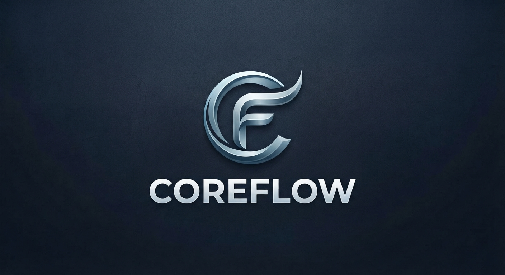
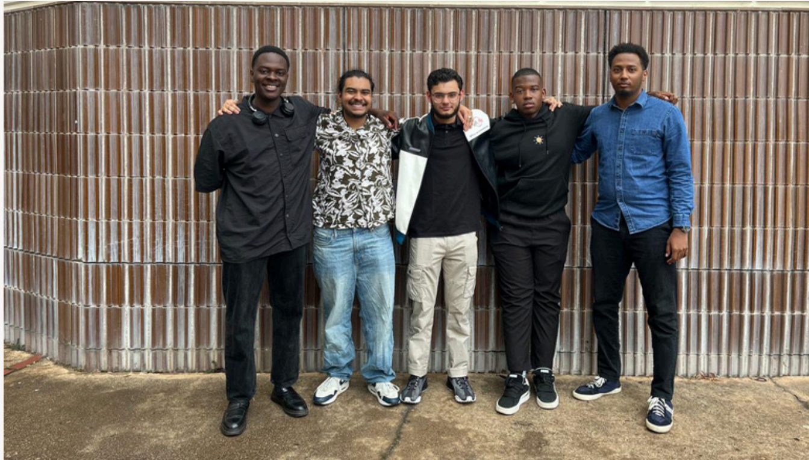

<div align="center">


# [](https://git.io/typing-svg)

---

Built by **[Coreflow](https://github.com/OptiGrid)**

---

<p align="center">
  <a href="https://github.com/COS301-SE-2026/OptiGrid/actions"></a>
  <a href="https://codecov.io/gh/COS301-SE-2026/OptiGrid"></a>
  <a href="https://github.com/COS301-SE-2026/OptiGrid"></a>
  <a href="https://github.com/COS301-SE-2026/OptiGrid/issues"></a>
  <br>
  <a href="https://uptimerobot.com"></a>
  <a href="https://github.com/COS301-SE-2026/OptiGrid/commits/main"></a>
  <a href="https://github.com/COS301-SE-2026/OptiGrid"></a>
  <a href="https://github.com/COS301-SE-2026/OptiGrid/blob/main/LICENSE"></a>
</p>

---

*In partnership with **EPI-USE***

**[OptiGrid URL](https://www.optigrid.co.za)** *(Click to view)*

</div>

<br>

<div align="center">
  
</div>

## Project Description

**Coreflow - OptiGrid** - A comprehensive software platform designed for intelligent energy optimisation and predictive analytics, utilising smart grid technology to help buildings reduce energy waste and optimise consumption.
The system connects building managers and energy grids through a sophisticated data pipeline that facilitates telemetry ingestion, communicates forecasts, manages configurations, and provides real-time monitoring – all without fundamentally changing the existing building's physical infrastructure.

<div align="center">
  
</div>

## GitHub Project Board
[View GitHub Project Board](https://github.com/orgs/COS301-SE-2026/projects/52)

## Documentation & Deliverables

<details>
<summary><b>Demo 1</b></summary>
<br>

- **SRS Document:** [Functional Requirements (SRS)](docs/SRS.md)
- **Design Specification:** [Design Specification and Brand Style Guide](docs/Brand_Style_Guide.pdf)

</details>

<details>
<summary><b>Demo 2</b></summary>
<br>

- **SRS Document:** [Functional Requirements (SRS)](docs/SRS.md)
- **SAS Document:** [Functional Requirements (SAS)](docs/SAS.pdf)
- **Coding Standards:** [Coding Standards Document](docs/Coding_Standards.pdf)
- **User Manual:** [User Manual](docs/User_Manual.pdf)
- **Testing Policy:** [Testing Policy Document](docs/Testing_Policy.pdf)
- **Brand Style Guide:** [Brand Style Guide](docs/Brand_Style_Guide.pdf)

</details>

<details>
<summary><b>Demo 3</b></summary>
<br>

- **SRS Document:** [Functional Requirements (SRS)](docs/SRS.md)
- **SAS Document:** [Tracebility Matrix and NFR (SAS)](docs/SAS.pdf)
- **Service Contracts:** [Service Contracts(SAS)](docs/SAS.pdf)
- **Coding Standards:** [Coding Standards Document](docs/Coding_Standards.pdf)
- **User Manual:** [User Manual](docs/User_Manual.pdf)
- **Testing Policy:** [Testing Policy Document](docs/Testing_Policy.pdf)
- **Brand Style Guide:** [Brand Style Guide](docs/Brand_Style_Guide.pdf)

</details>

<details>
<summary><b>Demo 4</b></summary>
<br>

- **NFR Testing (with evidence):** [NFR Testing Directory](docs/SAS.pdf)

</details>

<div align="center">
  
</div>

## Team: Coreflow

<div align="center">
  
</div>

| Name | Student Number | GitHub | LinkedIn | Profile |
|------|---------------|--------|----------|-----------|
| **Hamdaan Mirza** | `u24631494` | [GitHub](https://github.com/Hamdaan-Mirza) | [LinkedIn](https://www.linkedin.com/in/hamdaan-mirza/) | Team Lead, Backend Developer. Third Year IKS Student majoring in Data Science. Coding the backend endpoints and integrating them. Ensuring code is robust, secure and maintainable. |
| **Abdelrahman Ahmed** | `u24898008` | [GitHub](https://github.com/abdlrhmanhabish) | [LinkedIn](https://www.linkedin.com/in/abdelrahman-esam-9055413b4) | Frontend Developer. Third Year CS Student. Developing the responsive user interface and dynamic dashboards. Ensuring the frontend is intuitive, accessible and performant. |
| **Abhay Rooplall** | `u24568792` | [GitHub](https://github.com/AbhayR1) | [LinkedIn](https://www.linkedin.com/in/abhay-rooplall/) | Data & Analytics Engineer. Third Year CS Student. Designing and implementing data pipelines and predictive models. Ensuring telemetry analysis is accurate, scalable and efficient. |
| **Talifhani Seaba** | `u23657350` | [GitHub](https://github.com/TalifhaniSeaba) | [LinkedIn](https://www.linkedin.com/in/talifhani-seaba-2172bb32b/) | Frontend Developer. Third Year CS Student. Crafting seamless user experiences and interactive components. Ensuring the application styling is consistent, modern and responsive. |
| **Atidaishe Mupanemunda** | `u22747886` | [GitHub](https://github.com/WillyDoo428) | [LinkedIn](https://www.linkedin.com/in/atidaishe-m-218ba3388/) | Cloud & Infrastructure Engineer. Third Year CS Student. Managing CI/CD pipelines, containerization and deployments. Ensuring the infrastructure is highly available, scalable and secure. |

**Team Email:** cos301.coreflow@gmail.com

<div align="center">
  <strong>Team Photo:</strong><br><br>
  
</div>

<div align="center">
  
</div>

## Repository Structure

<details>
<summary><b>Click to expand project structure</b></summary>
<br>

```text
OptiGrid
├─ .dockerignore
├─ .eslintrc.cjs
├─ README.md
├─ backend
│  ├─ analytics
│  │  ├─ Dockerfile
│  │  ├─ requirements.txt
│  │  └─ src
│  ├─ configuration
│  ├─ core
│  │  ├─ .eslintignore
│  │  ├─ Dockerfile
│  │  ├─ jest.config.cjs
│  │  ├─ prisma/
│  │  ├─ prisma.config.ts
│  │  └─ src
│  │     ├─ app.ts
│  │     ├─ controllers/
│  │     ├─ lib/
│  │     ├─ routes/
│  │     ├─ server.ts
│  │     ├─ services/
│  │     ├─ types/
│  │     └─ validation/
│  └─ ingestion
│     ├─ Dockerfile
│     ├─ prisma/
│     ├─ requirements.txt
│     └─ src
├─ docker-compose.yml
├─ docs
│  ├─ SRS.md
│  |_ images/
├─ eslint.config.cjs
├─ frontend
│  ├─ .storybook
│  │  ├─ main.ts
│  │  └─ preview.ts
│  ├─ Dockerfile
│  ├─ app
│  │  ├─ (auth)
│  │  │  ├─ login/
│  │  │  └─ signup/
│  │  ├─ (dashboard)
│  │  │  ├─ buildings/
│  │  │  ├─ compare/
│  │  │  ├─ dashboard/
│  │  │  ├─ forecast/
│  │  ├─ api/
│  │  ├─ contact/
│  │  ├─ faqs/
│  │  ├─ health/
│  │  ├─ layout.tsx
│  │  ├─ page.tsx
│  │  └─ theme/
│  ├─ eslint.config.mjs
│  ├─ jest.config.cjs
│  ├─ jest.setup.ts
│  └─ tailwind.config.ts
├─ infrastructure
│  ├─ docker/
│  └─ terraform/
├─ playwright.config.ts
├─ pnpm-lock.yaml
├─ pnpm-workspace.yaml
├─ scripts/
├─ supabase/
└─ tests
   ├─ integration/
   └─ unit/
   |_e2e/
```

</details>

<div align="center">
  
</div>

## Technology Stack

<table>
  <tr>
    <td width="30%"><b>Frontend</b></td>
    <td>
      <a href="#"></a> 
      <a href="#"></a> 
      <a href="#"></a> 
      <a href="#"></a> 
      <a href="#"></a><br>
      <i>Next.js (React with TypeScript). For responsive web dashboard development. Fast iteration, rendering, and UI development using Tailwind CSS and Tremor. Supports dynamic data visualization via Recharts.</i>
    </td>
  </tr>
  <tr>
    <td><b>Backend</b></td>
    <td>
      <a href="#"></a> 
      <a href="#"></a> 
      <a href="#"></a> 
      <a href="#"></a><br>
      <i>Node.js (Express with TypeScript). High-performance REST API handling user requests, background tasks via BullMQ, caching via Redis, and automated data syncing.</i>
    </td>
  </tr>
  <tr>
    <td><b>Database</b></td>
    <td>
      <a href="#"></a> 
      <a href="#"></a> 
      <a href="#"></a> 
      <a href="#"></a><br>
      <i>PostgreSQL (Supabase) & InfluxDB. Relational metadata stored in PostgreSQL and time-series telemetry data stored in InfluxDB. Object-relational mapping handled by Prisma.</i>
    </td>
  </tr>
  <tr>
    <td><b>Analytics</b></td>
    <td>
      <a href="#"></a> 
      <a href="#"></a> 
      <a href="#"></a> 
      <a href="#"></a> 
      <a href="#"></a><br>
      <i>Python (Scikit-Learn, Prophet). Machine learning service for predicting energy demands. Optuna manages the lifecycle and hyperparameter tuning.</i>
    </td>
  </tr>
  <tr>
    <td><b>Infrastructure</b></td>
    <td>
      <a href="#"></a> 
      <a href="#"></a> 
      <a href="#"></a><br>
      <i>AWS. Infrastructure deployed via Terraform and managed with Docker containers.</i>
    </td>
  </tr>
  <tr>
    <td><b>DevOps & Security</b></td>
    <td>
      <a href="#"></a> 
      <a href="#"></a> 
      <a href="#"></a> 
      <a href="#"></a><br>
      <i>GitHub Actions. Automated pipelines for testing, linting, and deployment. Vulnerability scanning with Snyk.</i>
    </td>
  </tr>
  <tr>
    <td><b>Testing</b></td>
    <td>
      <a href="#"></a> 
      <a href="#"></a> 
      <a href="#"></a> 
      <a href="#"></a><br>
      <i>Jest, Pytest, Playwright. Unit and integration testing. End-to-end testing with Playwright.</i>
    </td>
  </tr>
</table>

<div align="center">
  
</div>

## Getting Started

<details open>
<summary><b>Prerequisites</b></summary>
<br>

<p>
  
  
  
  
  
  
</p>

Ensure the following are installed on your machine before proceeding:

- [Node.js 18+](https://nodejs.org/)
- [Python 3.11+](https://www.python.org/)
- [pnpm](https://pnpm.io/installation) - `npm install -g pnpm`
- [Docker](https://www.docker.com/get-started/) & Docker Compose
- [Redis](https://redis.io/docs/getting-started/) (or run via Docker)
</details>

<details>
<summary><b>Clone & Install Dependencies</b></summary>
<br>

```bash
git clone https://github.com/COS301-SE-2026/OptiGrid
cd OptiGrid

# Install all Node.js workspace dependencies (Frontend & Backend Core)
pnpm install

# Install Python Analytics dependencies
pip install -r backend/analytics/requirements.txt

# Install Python Ingestion dependencies
pip install -r backend/ingestion/requirements.txt
```
</details>

<details>
<summary><b>Environment Setup</b></summary>
<br>

Create a `.env.local` file in the root directory. Key environment variables include:

**Database & Supabase:**
| Variable | Description |
|----------|-------------|
| `DATABASE_URL` | PostgreSQL connection string (Supabase) |
| `SUPABASE_URL` / `NEXT_PUBLIC_SUPABASE_URL` | Your Supabase project URL |
| `SUPABASE_ANON_KEY` / `NEXT_PUBLIC_SUPABASE_ANON_KEY` | Supabase anonymous public key |
| `SUPABASE_SERVICE_ROLE_KEY` | Supabase service role key for backend operations |
| `SUPABASE_KEY` | Alias for Supabase key |

**InfluxDB:**
| Variable | Description |
|----------|-------------|
| `INFLUXDB_URL` | InfluxDB connection URL |
| `INFLUXDB_TOKEN` | InfluxDB authentication token |
| `INFLUXDB_ORG` | InfluxDB organization name |
| `INFLUXDB_BUCKET` | InfluxDB bucket name for energy data |

**Redis:**
| Variable | Description |
|----------|-------------|
| `REDIS_HOST` | Redis server hostname |
| `REDIS_PORT` | Redis port number |
| `REDIS_DB` | Redis database index |

**Third-party & Security:**
| Variable | Description |
|----------|-------------|
| `RESEND_API_KEY` | Resend API key for email notifications |
| `HARDWARE_API_KEY` | Authentication key for hardware sensors |
</details>

<details>
<summary><b>Run Locally</b></summary>
<br>

```bash
# Run all services concurrently
pnpm dev

# Run backend separately
pnpm --filter @optigrid/core dev

# Run frontend separately
pnpm --filter @optigrid/frontend dev
```
</details>

<details>
<summary><b>Run with Docker</b></summary>
<br>

```bash
docker-compose up --build
```
</details>

<details>
<summary><b>Run Lint</b></summary>
<br>

```bash
# Frontend
pnpm --filter @optigrid/frontend run lint

# Backend
pnpm --filter @optigrid/core run lint
```
</details>

<details>
<summary><b>Run Unit Tests</b></summary>
<br>

```bash
# Run all unit tests
pnpm test:all

# Frontend unit tests only
pnpm --filter @optigrid/frontend run test

# Backend unit tests only
pnpm --filter @optigrid/core run test
```
</details>

<details>
<summary><b>Run Scalability Tests</b></summary>
<br>

The isolated local Docker suite measures 50/100/150 telemetry requests per
second and reports both the original SRS-oriented criteria and revised
architectural capability checks. A capability pass percentage does not establish
SRS compliance; SC01 and scale-up request failures remain reported separately.

```powershell
npm install --prefix tests/nfr/scalability --ignore-scripts
npm run test:nfr:scalability:assessment
npm run test:nfr:scalability:preflight
npm run test:nfr:scalability
```

See the [setup and fixed test plan](tests/nfr/scalability/README.md),
[fresh benchmark results](docs/testing/scalability-results-v2-2026-09-03.md),
[preserved original results](docs/testing/scalability-results-2026-09-03-original.md),
and [revised-criteria reassessment](docs/testing/scalability-reassessment-v2-2026-09-03.md).
The full workload takes about 30 minutes after setup. A nonzero benchmark exit
code still indicates at least one failing check, even when 60% of checks pass.
</details>

<details>
<summary><b>Run Integration Tests</b></summary>
<br>

```bash
# Run all backend integration tests
pnpm --filter @optigrid/core run test:integration

# Run backend integration tests using local Supabase instance
pnpm --filter @optigrid/core run test:supabase
```
</details>

<details>
<summary><b>Run E2E Tests (Playwright)</b></summary>
<br>

Use this flow to run end-to-end tests using Playwright.

```bash
# Run standard E2E test suite
pnpm run test:e2e
```

**Running E2E tests with local Supabase:**
Use this flow when you want Playwright to test against the local Supabase emulator instead of the temporary Postgres container used by the default E2E launcher.

```bash
# Start local Supabase. If this repo has not been initialized locally yet,
# run 'supabase init' once from the repo root first.
supabase start
supabase status

# Run a specific test (e.g. create-building)
corepack pnpm run test:e2e:supabase -- tests/e2e/buildings/create-building.e2e.spec.ts
```

The Supabase E2E launcher reads `supabase status -o env` and maps the local `DB_URL`, `API_URL`, `ANON_KEY`, and `SERVICE_ROLE_KEY` into the app environment automatically. It also runs `prisma db push --accept-data-loss` before starting the core API. It does not run `supabase/seed.sql`; keep that seed aligned with the current Prisma schema before using `supabase db reset`.
</details>

<div align="center">
  
</div>

## Branching Strategy

This project follows **GitFlow**: a structured branching model that separates ongoing development from stable releases, enabling parallel feature work without destabilising production code.

| Branch | Purpose |
|--------|---------|
| `main` | Production-ready code only. Merges happen here via tagged releases from `develop`. Direct commits are not permitted. |
| `develop` | The primary integration branch. All completed features and fixes are merged here before being released to `main`. |
| `backend/feature/<name>` | Short-lived branches for individual backend features or fixes. Branch off `develop`, merge back via pull request once reviewed. |
| `frontend/feature/<name>` | Short-lived branches for individual frontend features or UI changes. Branch off `develop`, merge back via pull request once reviewed. |
| `integration/feature/<name>` | Used for cross-cutting changes that span both frontend and backend (e.g. new API contracts, full-stack features). Branch off `develop`, merge back after integrated testing. |

> **Pull Request policy:** All merges into `develop` require at least two approved reviews. All merges into `main` require at least three approved reviews. All merges must pass all CI checks before merging.

<div align="center">
  
</div>

## Contact

| Role | Name | Email |
|------|------|-------|
| **Project Owner** | Durandt Uys | durandt.uys@epiuse.com |
| **Project Mentor** | Bryan Janse van Vuuren | bryan.janse.van.vuuren@epiuse.com |
| **Team** | Coreflow | cos301.coreflow@gmail.com |

---

<div align="center">
  <a href="https://github.com/COS301-SE-2026/OptiGrid">
    
  </a>
  <br>
  <sub><b>© 2026 Coreflow · In partnership with EPI-USE</b></sub>
  <br>
</div>
