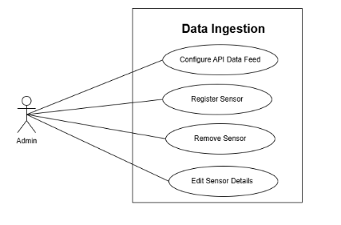
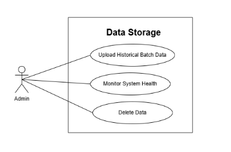
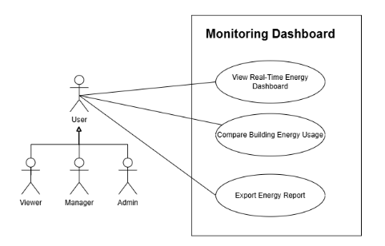
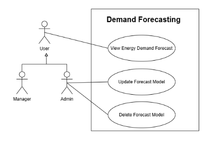
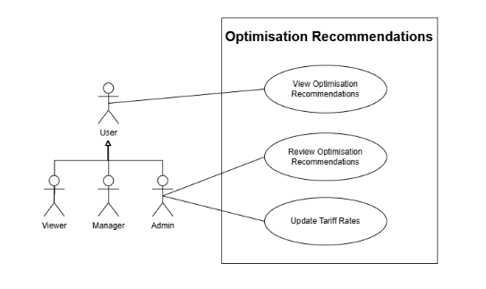
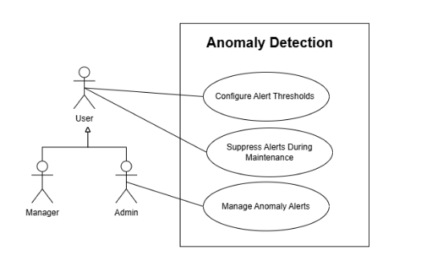
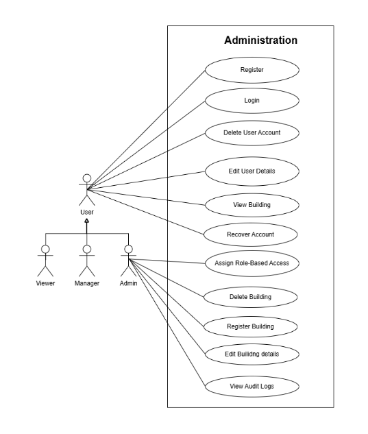
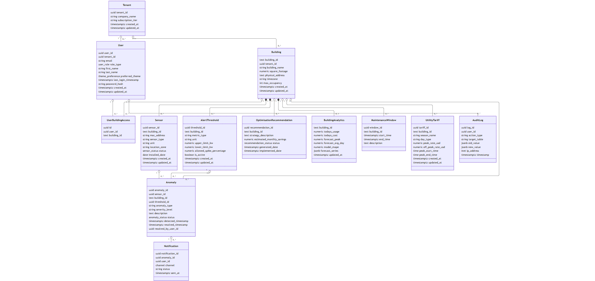
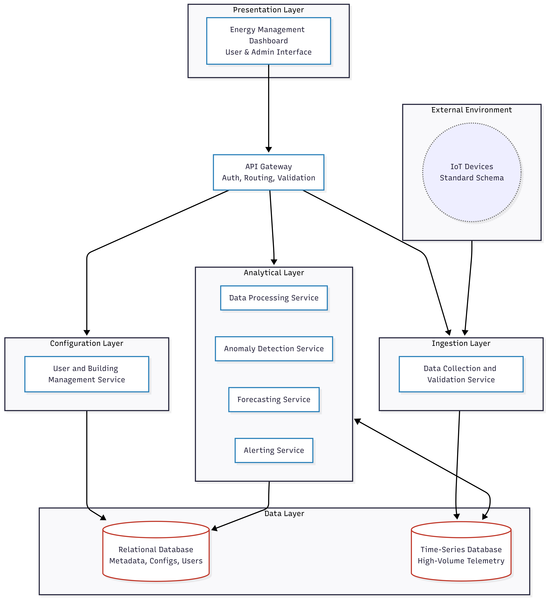

# Software Requirements and Design Specifications (SRS)
**Project Name:** OptiGrid
**Team Name:** Coreflow

---

## 1. Introduction 
* **Project Owner:** Durandt Uys
* **Project Mentor:** Bryan Janse van Vuuren
* **Owner Email:** durandt.uys@epiuse.com
* **Mentor Email:** bryan.janse.van.vuuren@epiuse.com

## 2. Project Vision and Objectives

### Background and Vision
The vision of OptiGrid is to design and implement a scalable, intelligent energy optimisation platform. The system addresses the critical need for effective resource management by providing a centralized, dashboard-first environment for monitoring real-time and historical energy consumption across multiple buildings. 

### Core Objectives
To achieve this vision and solve the problem of undetected energy waste, the system aims to:
* **Monitor Consumption:** Track real-time and historical energy usage across multiple buildings to establish an accurate baseline.
* **Detect Inefficiencies:** Identify abnormal usage patterns and energy spikes to mitigate unnecessary utility costs and equipment strain.
* **Predict Demand:** Forecast future energy demand using intelligent modeling to help facility managers prepare for peak loads.
* **Recommend Optimisations:** Provide actionable load-shifting and cost-saving strategies based on utility tariff rates.
* **Support Decision-Making:** Enable data-driven energy management decisions through robust reporting and role-based insights.

***

## 2. User Stories & User Characteristics 
Intended Users and how they  will use system

***

## 3. Use Cases
***
## 1. Data Ingestion
### Use Cases

**Use Case 1: Configure API Data Feed**
* **Actor:** Admin
* **TUCBW:** The Admin enters API credentials for a new building's IoT sensor network and clicks "Connect".
* **TUCEW:** The system verifies the connection and begins displaying real-time data ingestion status.

**Use Case 2: Register Sensor**
* **Actor:** Admin
* **TUCBW:** The Admin selects a building profile, clicks "Register Sensor," and enters the MAC address for a newly installed IoT meter.
* **TUCEW:** The system registers the new sensor, linking its incoming telemetry stream to the specified building and physical zone.

**Use Case 3: Remove Sensor**
* **Actor:** Admin
* **TUCBW:** The Admin selects an existing sensor from the building inventory and clicks "Remove."
* **TUCEW:** The system severs the telemetry link and archives the sensor's historical data.

**Use Case 4: Edit Sensor Details**
* **Actor:** Admin
* **TUCBW:** The Admin selects a sensor and modifies its metadata (e.g., location name, calibration threshold).
* **TUCEW:** The system saves the updated details and applies them to the dashboard views.

### Use Case Diagram

***

## 2. Data Storage
### Use Cases

**Use Case 5: Upload Historical Batch Data**
* **Actor:** Admin
* **TUCBW:** The Admin selects a historical CSV data file and clicks "Upload" in the data storage portal.
* **TUCEW:** The Admin receives a notification that the batch data was successfully parsed and stored.

**Use Case 6: Monitor System Health**
* **Actor:** Admin
* **TUCBW:** The Admin opens the DevOps Health Dashboard from the global navigation menu.
* **TUCEW:** The Admin views live operational metrics detailing API ingestion rates, database uptime, and microservice failure logs.

**Use Case 7: Delete Data**
* **Actor:** Admin
* **TUCBW:** The Admin selects a legacy batch data file or timeframe and clicks "Delete Data."
* **TUCEW:** The system permanently purges the selected records to free up storage space.

### Use Case Diagram

***

## 3. Monitoring Dashboard
### Use Cases

**Use Case 8: View Real-Time Energy Dashboard**
* **Actor:** User (Includes Viewer, Manager, Admin)
* **TUCBW:** The User navigates to the "Energy Dashboard" tab from the main menu.
* **TUCEW:** The User sees interactive charts showing current energy draw and peak usage trends for their assigned buildings.

**Use Case 9: Compare Building Energy Usage**
* **Actor:** User (Includes Viewer, Manager, Admin)
* **TUCBW:** The User selects multiple buildings from the comparison menu and clicks "Compare".
* **TUCEW:** The system renders a side-by-side graphical comparison of the selected buildings.

**Use Case 10: Export Energy Report**
* **Actor:** User (Includes Viewer, Manager, Admin)
* **TUCBW:** The User selects a date range, filters for specific usage, and clicks "Export".
* **TUCEW:** The User successfully downloads a formatted report containing the requested charts and aggregate data.

### Use Case Diagram

***

## 4. Demand Forecasting
### Use Cases

**Use Case 11: View Energy Demand Forecast**
* **Actor:** User (Includes Manager, Admin)
* **TUCBW:** The User selects the "Demand Forecast" view for the upcoming 72 hours.
* **TUCEW:** The system displays the predicted energy load, incorporating weather and occupancy inputs.

**Use Case 12: Update Forecast Model**
* **Actor:** Admin
* **TUCBW:** The Admin uploads a newly trained, higher-accuracy machine learning prediction model.
* **TUCEW:** The system validates the model, hot-swaps it with the currently active version, and generates all future forecasts using the updated algorithm.

**Use Case 13: Delete Forecast Model**
* **Actor:** Admin
* **TUCBW:** The Admin selects a deprecated forecast model from the system repository and clicks "Delete."
* **TUCEW:** The system removes the model from the repository.

### Use Case Diagram

***

## 5. Optimisation Recommendations
### Use Cases

**Use Case 14: View Optimisation Recommendations**
* **Actor:** User (Includes Viewer, Manager, Admin)
* **TUCBW:** The User opens the "Insights" panel from the dashboard.
* **TUCEW:** The User views a high-level list of suggested load-shifting strategies.

**Use Case 15: Review Optimisation Recommendations**
* **Actor:** Manager, Admin
* **TUCBW:** The Manager or Admin clicks on a specific optimisation recommendation to evaluate its feasibility.
* **TUCEW:** The system displays detailed cost-saving estimates, allowing the user to approve or dismiss the insight.

**Use Case 16: Update Tariff Rates**
* **Actor:** Admin
* **TUCBW:** The Admin navigates to the billing settings and inputs the new seasonal Time-of-Use rates.
* **TUCEW:** The system recalculates all future optimisation cost-saving insights based on the newly entered rates.

### Use Case Diagram

***

## 6. Anomaly Detection
### Use Cases

**Use Case 17: Configure Alert Thresholds**
* **Actor:** User (Includes Manager, Admin)
* **TUCBW:** The User navigates to the Anomaly Settings panel and inputs a new percentage threshold for power spikes.
* **TUCEW:** The system saves the custom threshold and applies it to future real-time anomaly evaluations.

**Use Case 18: Suppress Alerts During Maintenance**
* **Actor:** User (Includes Manager, Admin)
* **TUCBW:** The User creates a "Maintenance Window" in the system calendar for an upcoming generator test.
* **TUCEW:** The system updates its rules to temporarily mute anomaly alerts for that specific building during the defined timeframe.

**Use Case 19: Manage Anomaly Alerts**
* **Actor:** Manager, Admin
* **TUCBW:** The Manager clicks the link provided in an automated anomaly SMS alert.
* **TUCEW:** The Manager marks the alert as "Investigating" and closes the ticket.

### Use Case Diagram

***

## 7. Administration
### Use Cases

**Use Case 20: Register**
* **Actor:** User
* **TUCBW:** A new User accesses the portal and completes the self-registration form.
* **TUCEW:** The system creates a preliminary profile pending Admin approval.

**Use Case 21: Login**
* **Actor:** User
* **TUCBW:** The User enters their credentials into the portal.
* **TUCEW:** The system authenticates the user and loads their role-specific dashboard.

**Use Case 22: Recover Account**
* **Actor:** User
* **TUCBW:** The User clicks "Forgot Password," enters their email, and submits the request.
* **TUCEW:** The User receives a secure recovery link via email and successfully updates their credentials.

**Use Case 23: View Building**
* **Actor:** User
* **TUCBW:** The User selects a building from the portfolio directory.
* **TUCEW:** The system loads the foundational metadata and status of that specific building.

**Use Case 24: Register Building**
* **Actor:** Admin
* **TUCBW:** The Admin clicks "Add Building" and submits the configuration form.
* **TUCEW:** The new building appears in the multi-tenant portfolio list.

**Use Case 25: Edit Building Details**
* **Actor:** Admin
* **TUCBW:** The Admin selects an existing building and updates its square footage or operating hours.
* **TUCEW:** The system saves the updated building configuration.

**Use Case 26: Delete Building**
* **Actor:** Admin
* **TUCBW:** The Admin selects a building and initiates the deletion process.
* **TUCEW:** The system removes the building and archives all associated historical data.

**Use Case 27: Delete User Account**
* **Actor:** Admin
* **TUCBW:** The Admin selects an active user profile and clicks "Deactivate/Delete."
* **TUCEW:** The system revokes the user's access tokens and removes their login capability.

**Use Case 28: Edit User Details**
* **Actor:** Admin
* **TUCBW:** The Admin modifies an existing user's contact information or department.
* **TUCEW:** The system saves the updated user profile.

**Use Case 29: Assign Role-Based Access**
* **Actor:** Admin
* **TUCBW:** The Admin selects a user, assigns a specific role (e.g., Viewer), and restricts their view to certain buildings.
* **TUCEW:** The system saves the permissions, ensuring the user can only access authorized data upon login.

**Use Case 30: View Audit Logs**
* **Actor:** Admin
* **TUCBW:** The Admin accesses the Security & Audit tab and filters the system logs.
* **TUCEW:** The system displays a chronological ledger of user logins and configuration modifications.

### Use Case Diagram

***

## 4. Functional Requirements

### R1: Multi-Building Data Ingestion

#### R1.1: Protocol & Format Support
* **R1.1.1:** The system shall natively ingest telemetry data via API push endpoints.
* **R1.1.2:** The system shall support manual and automated batch ingestion of CSV and JSON file formats.
* **R1.1.3:** The system shall standardize all incoming data payloads into a unified JSON schema before storage.
* **R1.1.4:** The system shall normalize all timestamps to UTC and convert regional units (e.g., BTUs, Joules) to standard Kilowatt-hours (kWh).

#### R1.2: Processing Modes & Resiliency
* **R1.2.1:** The system shall process real-time incoming telemetry with a latency of no more than 2 seconds.
* **R1.2.2:** The system shall utilize a message broker to queue incoming data during database unavailability to prevent data loss.
* **R1.2.3:** The system shall reject malformed payloads and log the specific validation error in an error log for admin review.

#### R1.3: Multi-Building Support
* **R1.3.1:** The system shall enforce the inclusion of a valid, unique Building_ID and Meter_ID on every ingested data point.

#### R1.4: Data Validation & Quality Control
* **R1.4.1:** The system shall validate all incoming telemetry for required fields.
* **R1.4.2:** The system shall detect and flag duplicate data points.
* **R1.4.3:** The system shall handle missing values using configurable strategies.

### R2: Energy Data Storage Layer

#### R2.1: Centralised Time-Series Storage
* **R2.1.1:** The system shall store all valid telemetry data in a time-series database which is InfluxDB.
* **R2.1.2:** The system shall partition database records to optimize multi-tenant query speeds.

#### R2.2: Historical Analytics Capability
* **R2.2.1:** The system shall execute background tasks to automatically pre-aggregate high-frequency data into 15-minute, 1-hour, and 24-hour roll-ups.

#### R2.3: Efficient Querying & Lifecycle
* **R2.3.1:** The system shall execute automated scripts to archive raw data older than 24 months into cold object storage to maintain database performance.
* **R2.3.2:** The system shall respond to dashboard data queries for the last 30 days of aggregated data in under 2 seconds.

### R3: Energy Monitoring Dashboard

#### R3.1: Building Energy Visualization
* **R3.1.1:** The system shall render charts detailing energy usage per building.
* **R3.1.2:** The system shall allow users to interact with charts via zoom, pan.

#### R3.2: Building Comparison
* **R3.2.1:** The system shall provide a multi-select interface allowing users to overlay up to five different buildings on a single chart axis.
* **R3.2.2:** The system shall mathematically normalize comparison data by square footage, Energy Use Intensity when buildings are of different sizes.

#### R3.3: Export & Reporting
* **R3.3.1:** The system shall allow users to export the raw data of any currently viewed chart into a CSV format.
* **R3.3.2:** The system shall allow users to download a formatted PDF snapshot of the current dashboard layout.

### R4: Anomaly Detection System

#### R4.1: Pattern & Spike Detection
* **R4.1.1:** The system shall continuously calculate a rolling historical baseline for expected energy consumption.
* **R4.1.2:** The system shall trigger an anomaly event when real-time consumption deviates from the baseline by a user-chosen percentage (e.g., > 20% spike).
* **R4.1.3:** The system shall trigger a "Meter Offline" anomaly if zero telemetry is received from a known meter for 15 minutes.

#### R4.2: Automated Alerts & Management
* **R4.2.1:** The system shall dispatch tiered notifications via Email or SMS immediately upon detecting an anomaly.
* **R4.2.2:** The system shall allow administrators to configure "Maintenance Windows" during which all anomaly alerts for a specific building are suppressed.

#### R4.3: Alert Configuration
* **R4.3.1:** The system shall allow users to configure anomaly thresholds per building or meter.
* **R4.3.2:** The system shall allow users to configure notification preferences (Email/SMS).

### R5: Energy Demand Forecasting

#### R5.1: Prediction Models
* **R5.1.1:** The system shall utilize historical consumption data to generate localized short-term demand forecasts (up to 7 days in advance).

#### R5.2: Contextual Inputs
* **R5.2.1:** The system shall automatically query external third-party APIs to ingest local weather forecasts (temperature, humidity) into the prediction model.
* **R5.2.2:** The system shall allow administrators to input building occupancy schedules and public holidays to adjust the forecast algorithms downwards during low-use periods.

#### R5.3: Forecast Model Management
* **R5.3.1:** The system shall allow periodic retraining of forecasting models using updated historical data.
* **R5.3.2:** The system shall allow administrators or system processes to update, delete or edit forecasting models without downtime.
* **R5.3.3:** The system shall log model versioning information for traceability of predictions.

### R6: Optimisation Recommendation Engine

#### R6.1: Load Shifting & Adjustments
* **R6.1.1:** The system shall analyze forecasted peak demand times against active utility tariff schedules.
* **R6.1.2:** The system shall generate text-based recommendations for off-peak usage adjustments (e.g., "Pre-cool building at 05:00 AM").

#### R6.2: Financial Insights
* **R6.2.1:** The system shall mathematically calculate and display an estimated monthly cost savings metric for each generated recommendation.

### R7: Administrative & Role-Based Access (RBAC)

#### R7.1: Multi-Tenant Isolation
* **R7.1.1:** The system shall enforce strict row-level security on all database queries, ensuring users can only access telemetry linked to their assigned tenant organization.

#### R7.2: Access Control
* **R7.2.1:** The system shall enforce secure login procedures including password complexity rules and optional Multi-Factor Authentication (MFA).
* **R7.2.2:** The system shall support a minimum of three distinct roles: Global Admin (full access), Facility Manager (building-specific edit access), and Tenant Viewer (building-specific read-only access).

#### R7.3: Building Configuration
* **R7.3.1:** The system shall provide a CRUD (Create, Read, Update, Delete) UI for managing building metadata, including physical address, square footage, and timezone.

#### R7.4: User Management Lifecycle
* **R7.4.1:** The system shall allow users to create new accounts.
* **R7.4.2:** The system shall allow administrators to update user roles.
* **R7.4.3:** The system shall allow users to deactivate or delete their accounts.
* **R7.4.4:** The system shall allow users to edit details on their accounts.
* **R7.4.5:** The system shall enforce that deactivated users cannot access the system.

### R8: Device / Sensor Management

#### R8.1: Device & Meter Management
* **R8.1.1:** The system shall allow administrators to register, update, and deactivate meters.
* **R8.1.2:** The system shall associate each meter with a specific building.
* **R8.1.3:** The system shall store metadata for each meter.

### R9: Audit Logging & Compliance

#### R9.1: Audit & Activity Logging
* **R9.1.1:** The system shall log all user actions (login, data changes, configuration updates).
* **R9.1.2:** The system shall allow administrators to view audit logs.

## 5. API Service Contracts
Swagger docs basically

## 6. Domain Model
Domain Model of system

## 7. Architectural Requirements

• Microservice-based architecture
• Separation of ingestion, analytics, and presentation layers
• Horizontal scalability for multi-building environments
• RESTful API-first design
• Containerised deployment (Docker)Secure authentication & RBAC
• High availability design (minimum 95% uptime)

### 7.1 Quality Requirements
non-functional requirements essentially
### 7.2 Architectural Patterns
high level system with design
### 7.3 Design Patterns
design patterns used in the project
### 7.4 Constraints
Constraints for the project

* Limited access to real building infrastructure (simulated data may be used)
* Budget constraints for hosting
* No access to proprietary smart grid systems
* Must rely on open APIs or simulated IoT feeds

### 7.5 Technology Requirements
Tech Stack

* **Frontend**:react 
* **Backend**:Node.js
* **Database**: PostgreSQL
* **Analytics**: Python
* **Infrastructure**: Docker 
* **DevOps**: GitHub

## 8. Architecture Diagram

## 9. Traceability Matrix
mapping use cases and requirements