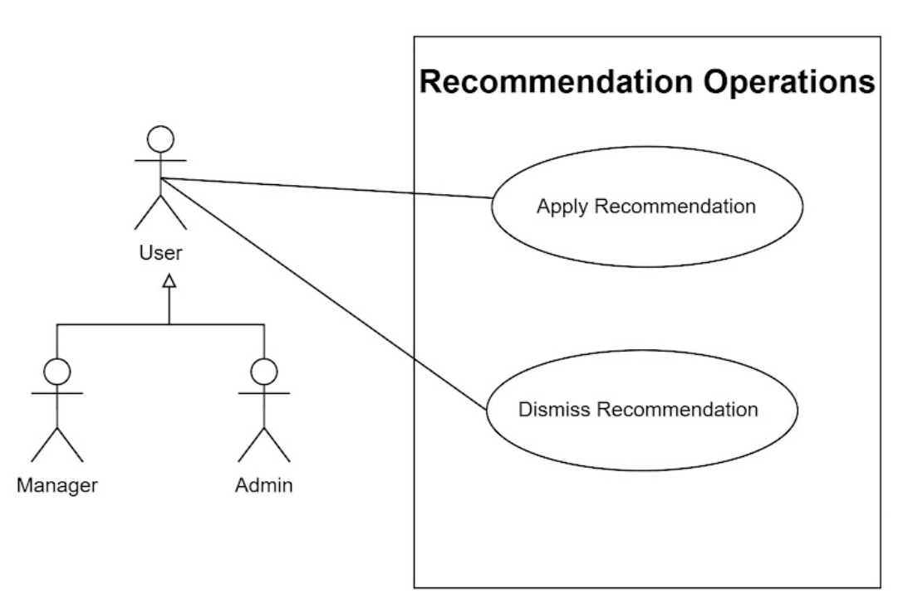
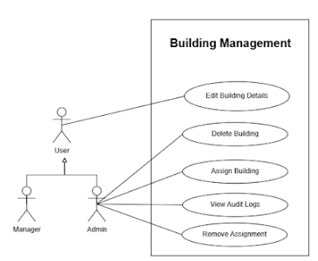
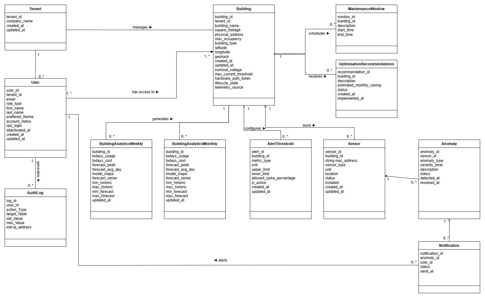

# Software Requirements and Design Specifications (SRS)
**Project Name:** OptiGrid
**Team Name:** Coreflow

---

## Table of Contents
* [1. Introduction](#1-introduction)
* [2. Project Vision and Objectives](#2-project-vision-and-objectives)
* [3. User Stories & User Characteristics](#3-user-stories--user-characteristics)
* [4. Use Cases](#4-use-cases)
* [5. Functional Requirements](#5-functional-requirements)
* [6. Non-Functional Requirements](#6-non-functional-requirements)
* [7. Domain Model](#7-domain-model)

***

## 1. Introduction 
* **Project Owner:** Durandt Uys
* **Project Mentor:** Bryan Janse van Vuuren
* **Owner Email:** durandt.uys@epiuse.com
* **Mentor Email:** bryan.janse.van.vuuren@epiuse.com

## 2. Project Vision and Objectives

### Background and Vision
The vision of OptiGrid is to design and implement a scalable, intelligent energy optimisation platform. The system addresses the critical need for effective resource management by providing a centralised, dashboard-first environment for monitoring real-time and historical energy consumption across multiple buildings. 

### Core Objectives
To achieve this vision and solve the problem of undetected energy waste, the system aims to:
* **Monitor Consumption:** Track real-time and historical energy usage across multiple buildings to establish an accurate baseline.
* **Detect Inefficiencies:** Identify abnormal usage patterns and energy spikes to mitigate unnecessary utility costs and equipment strain.
* **Predict Demand:** Forecast future energy demand using intelligent modeling to help facility managers prepare for peak loads.
* **Recommend Optimisations:** Provide actionable load-shifting and cost-saving strategies based on utility tariff rates.
* **Support Decision-Making:** Enable data-driven energy management decisions through robust reporting and role-based insights.

***

## 3. User Stories & User Characteristics 

### 3.1 User Characteristics
The users of the OptiGrid system are expected to fit into the following groups:

#### Administrator User Characteristics
| Attribute | Description |
| :--- | :--- |
| **Digital Literacy** | High. Comfortable managing system configurations, API credentials, and role-based access control. |
| **Access to Reliable Internet and Data** | Excellent. Operates primarily from desktop computers in corporate office environments with high speed internet. |
| **Concerns Around Trust and Safety** | High concern for data breaches, system vulnerabilities, and unauthorized access to IoT endpoints. |
| **Reasons for Using the Platform** | To manage the entire OptiGrid platform, configure building profiles, handle sensor connectivity, and assign user permissions across the organisation. |
| **Platform Interaction Needs** | Needs comprehensive tools to add/edit/delete buildings, register IoT sensors, manage users, and view system wide diagnostics. |
| **Goals and Incentives for Using the App** | Maintain a secure, accurately configured platform to ensure reliable data flow and system availability for all other users. |

#### Building Manager User Characteristics
| Attribute | Description |
| :--- | :--- |
| **Digital Literacy** | Moderate to high. Comfortable with data dashboards, interpreting charts, and managing building operations. |
| **Access to Reliable Internet and Data** | Good. Operates from office environments or on site via laptops and mobile devices, generally with stable WiFi. |
| **Concerns Around Trust and Safety** | Worries about misconfiguration leading to loss of sensor data or inaccurate billing estimates. |
| **Reasons for Using the Platform** | To monitor real time energy consumption, receive anomaly alerts, and view demand forecasts for their assigned buildings to reduce operational costs. |
| **Platform Interaction Needs** | Needs to view detailed building energy profiles, compare energy usage between facilities, review predictive analytics, and export reports. |
| **Goals and Incentives for Using the App** | To identify energy waste, reduce utility bills, and optimise building energy performance using data driven insights. |

#### Viewer User Characteristics
| Attribute | Description |
| :--- | :--- |
| **Digital Literacy** | Varies widely. Ranges from both ends of the digital literacy spectrum |
| **Access to Reliable Internet and Data** | Good. Accesses the platform via standard web browsers on various devices. |
| **Concerns Around Trust and Safety** | Low direct risk, but expects personal data and passwords to be handled securely. |
| **Reasons for Using the Platform** | To gain visibility into the energy performance of specific buildings or zones without needing to alter configurations. |
| **Platform Interaction Needs** | Needs simple, read-only dashboards with clear visual indicators of current energy usage and historical trends. |
| **Goals and Incentives for Using the App** | Stay informed about energy consumption targets and overall sustainability metrics of their assigned facilities. |

### 3.2 User Stories

#### Administrator User Stories
| User Story | Acceptance Criteria | Definition of Done |
| :--- | :--- | :--- |
| **Account Registration & Login** As an Admin, I want to log in to my account, so that I can securely access the platform. | Given that I am on the landing page, When I submit valid login credentials, Then I should be authenticated and redirected to the dashboard. | Based on my input credentials, I am securely authenticated and taken to the home page. |
| **View Real-Time Dashboard** As an Admin, I want to view all buildings on a dashboard, so that I can quickly assess current energy status. | Given I am logged in, When I open the dashboard, Then I should see buildings, total energy usage, and active alerts. | The dashboard successfully loads and accurately displays metrics for the buildings. |
| **Compare Building Energy Usage** As an Admin, I want to compare the energy usage of multiple buildings, so that I can identify which facilities are underperforming. | Given I am on the comparison page, When I select two buildings and a time range, Then the system displays a comparative chart of their energy consumption. | A comparative chart is generated displaying the energy data of the selected buildings. |
| **Export Energy Report** As an Admin, I want to export data, so that I can share building performance metrics. | Given I have filtered the dashboard data, When I click "Export", Then I should receive a downloadable report. | The report file is successfully generated and downloaded to the user's device. |
| **View Optimisation Recommendations** As an Admin, I want to view load shifting strategies, so that I understand how the building can save on utility costs. | Given I am on the insights panel, When I review the list of suggestions, Then I should see actionable recommendations for the building. | Optimisation suggestions are populated and visible. |
| **View Energy Forecast** As an Admin, I want to view an energy demand forecast, so that I can proactively adjust operations for peak loads. | Given I am viewing a specific building, When I request a forecast, Then the system displays a chart showing predicted energy demand. | The ML model generates and displays the forecast chart. |
| **Review Optimisation Insights** As an Admin, I want to review detailed cost saving estimates, so that I can approve or dismiss an insight. | Given I select an optimisation insight, When I review the details, Then I can click "Approve" or "Dismiss". | The system logs the action and updates the insight status. |
| **Manage Anomaly Alerts** As an Admin, I want to investigate and close anomaly alerts, so that my team knows the issue is handled. | Given I receive an alert, When I mark it as "Investigating" and close it, Then the ticket status updates. | The ticket is closed in the system and removed from the active alerts list. |
| **Create Building** As an Admin, I want to register a new building profile, so that I can begin linking IoT meters. | Given I am on the dashboard, When I choose "Add Building" and submit details, Then the building should be saved. | The building is created and visible in the database and dashboard list. |
| **Edit Building** As an Admin, I want to update a building's metadata, so that calculations remain accurate. | Given I am viewing building details, When I modify the attributes and save, Then changes immediately reflect on the dashboard. | Metadata is successfully updated in the system. |
| **Delete Building** As an Admin, I want to delete a building from the platform, so that the system portfolio reflects only managed properties. | Given I select a building, When I click "Delete" and confirm, Then it is removed from my view. | The building is successfully deleted and removed from lists. |
| **Register Sensor** As an Admin, I want to register an IoT sensor to a building, so that telemetry data can be ingested correctly. | Given I am on the manage sensors page, When I enter a valid MAC address and details, Then the sensor is linked to the building. | The sensor is successfully registered and begins routing data. |
| **Remove Sensor** As an Admin, I want to remove a sensor from a building, so that discontinued hardware no longer impacts readings. | Given I select an existing sensor, When I click "Remove", Then the telemetry link is severed. | The sensor is archived and its data stream is stopped. |
| **Edit Sensor Details** As an Admin, I want to edit a sensor's metadata, so that location names and thresholds are accurate. | Given I select a sensor, When I modify its location name and save, Then the updated details are saved. | The sensor metadata is updated across all dashboard views. |
| **Upload Historical Batch Data** As an Admin, I want to upload historical CSV data, so that the machine learning models have training data. | Given I am on the data storage portal, When I upload a valid CSV file, Then the data is parsed and stored. | The admin receives a notification that the batch data was successfully processed. |
| **Monitor System Health** As an Admin, I want to monitor the DevOps health dashboard, so that I can ensure API ingestion and microservices are running. | Given I open the health dashboard, When the page loads, Then I see live operational metrics. | Real time metrics for API ingestion and database uptime are displayed. |
| **Delete Data** As an Admin, I want to delete legacy batch data, so that I can free up database storage. | Given I select a historical timeframe, When I click "Delete Data", Then the records are permanently purged. | The selected records are successfully deleted from the database. |
| **Update Forecast Model** As an Admin, I want to upload a new ML forecasting model, so that predictions become more accurate. | Given I upload a new model file, When it passes validation, Then it hot swaps with the current version. | The new model is active and future forecasts are generated using it. |
| **Delete Forecast Model** As an Admin, I want to delete a deprecated forecast model, so that it is no longer used by the system. | Given I select an old model, When I click "Delete", Then it is removed from the repository. | The model is permanently removed from the system. |
| **Update Tariff Rates** As an Admin, I want to update seasonal Time of Use rates, so that cost saving recommendations are financially accurate. | Given I navigate to billing settings, When I input new TOU rates, Then all future cost insights are recalculated. | The new rates are stored and actively used in the optimisation engine. |

#### Building Manager User Stories
| User Story | Acceptance Criteria | Definition of Done |
| :--- | :--- | :--- |
| **Account Registration & Login** As a Manager, I want to log in to my account, so that I can securely access the platform. | Given that I am on the landing page, When I submit valid login credentials, Then I should be authenticated and redirected to the dashboard. | Based on my input credentials, I am securely authenticated and taken to the home page. |
| **View Real-Time Dashboard** As a Manager, I want to view my assigned buildings on a dashboard, so that I can quickly assess current energy status. | Given I am logged in, When I open the dashboard, Then I should see my buildings, total energy usage, and active alerts. | The dashboard successfully loads and accurately displays metrics for the assigned buildings. |
| **Compare Building Energy Usage** As a Manager, I want to compare the energy usage of multiple buildings, so that I can identify which facilities are underperforming. | Given I am on the comparison page, When I select two buildings and a time range, Then the system displays a comparative chart of their energy consumption. | A comparative chart is generated displaying the energy data of the selected buildings. |
| **Export Energy Report** As a Manager, I want to export data, so that I can share building performance metrics. | Given I have filtered the dashboard data, When I click "Export", Then I should receive a downloadable report. | The report file is successfully generated and downloaded to the user's device. |
| **View Optimisation Recommendations** As a Manager, I want to view load shifting strategies, so that I understand how the building can save on utility costs. | Given I am on the insights panel, When I review the list of suggestions, Then I should see actionable recommendations for the building. | Optimisation suggestions are populated and visible. |
| **View Energy Forecast** As a Manager, I want to view an energy demand forecast, so that I can proactively adjust operations for peak loads. | Given I am viewing a specific building, When I request a forecast, Then the system displays a chart showing predicted energy demand. | The ML model generates and displays the forecast chart. |
| **Review Optimisation Insights** As a Manager, I want to review detailed cost saving estimates, so that I can approve or dismiss an insight. | Given I select an optimisation insight, When I review the details, Then I can click "Approve" or "Dismiss". | The system logs the action and updates the insight status. |
| **Manage Anomaly Alerts** As a Manager, I want to investigate and close anomaly alerts, so that my team knows the issue is handled. | Given I receive an alert, When I mark it as "Investigating" and close it, Then the ticket status updates. | The ticket is closed in the system and removed from the active alerts list. |

#### Viewer User Stories
| User Story | Acceptance Criteria | Definition of Done |
| :--- | :--- | :--- |
| **Account Registration & Login** As a Viewer, I want to sign up and log in to my account, so that I can securely access the platform. | Given that I am on the landing page, When I submit valid registration or login credentials, Then I should be authenticated and redirected to the dashboard. | Based on my input credentials, I am securely authenticated and taken to the home page. |
| **View Real-Time Dashboard** As a Viewer, I want to view my assigned buildings on a dashboard, so that I can quickly assess current energy status. | Given I am logged in, When I open the dashboard, Then I should see my buildings, total energy usage, and active alerts. | The dashboard successfully loads and accurately displays metrics for the assigned buildings. |
| **Compare Building Energy Usage** As a Viewer, I want to compare the energy usage of multiple buildings, so that I can identify which facilities are underperforming. | Given I am on the comparison page, When I select two buildings and a time range, Then the system displays a comparative chart of their energy consumption. | A comparative chart is generated displaying the energy data of the selected buildings. |
| **Export Energy Report** As a Viewer, I want to export data, so that I can share building performance metrics. | Given I have filtered the dashboard data, When I click "Export", Then I should receive a downloadable report. | The report file is successfully generated and downloaded to the user's device. |
| **View Optimisation Recommendations** As a Viewer, I want to view load shifting strategies, so that I understand how the building can save on utility costs. | Given I am on the insights panel, When I review the list of suggestions, Then I should see actionable recommendations for the building. | Optimisation suggestions are populated and visible. |

***

## 4. Use Cases
***
## 4.1 Data Ingestion
### Use Cases

**Use Case 1: Configure API Data Feed**
* **Actor:** Admin
* **TUCBW:** The Admin enters API credentials for a new building's IoT sensor network and clicks "Connect".
* **TUCEW:** The system verifies the connection and begins displaying real-time data ingestion status.

**Use Case 2: Register Sensor**
* **Actor:** Admin
* **TUCBW:** The Admin selects a building profile, clicks "Register Sensor," and enters the MAC address for a newly installed IoT meter.
* **TUCEW:** The system registers the new sensor, linking its incoming telemetry stream to the specified building and physical zone.

**Use Case 3: Remove Sensor**
* **Actor:** Admin
* **TUCBW:** The Admin selects an existing sensor from the building inventory and clicks "Remove."
* **TUCEW:** The system severs the telemetry link and archives the sensor's historical data.

**Use Case 4: Edit Sensor Details**
* **Actor:** Admin
* **TUCBW:** The Admin selects a sensor and modifies its metadata (e.g., location name, calibration threshold).
* **TUCEW:** The system saves the updated details and applies them to the dashboard views.

### Use Cases Diagram

***

## 4.2 Data Storage
### Use Cases

**Use Case 5: Upload Historical Batch Data**
* **Actor:** Admin
* **TUCBW:** The Admin selects a historical CSV data file and clicks "Upload" in the data storage portal.
* **TUCEW:** The Admin receives a notification that the batch data was successfully parsed and stored.

**Use Case 6: Monitor System Health**
* **Actor:** Admin
* **TUCBW:** The Admin opens the DevOps Health Dashboard from the global navigation menu.
* **TUCEW:** The Admin views live operational metrics detailing API ingestion rates, database uptime, and microservice failure logs.

**Use Case 7: Delete Data**
* **Actor:** Admin
* **TUCBW:** The Admin selects a legacy batch data file or timeframe and clicks "Delete Data."
* **TUCEW:** The system permanently purges the selected records to free up storage space.

### Use Cases Diagram

***

## 4.3 Monitoring Dashboard
### Use Cases

**Use Case 8: View Real-Time Energy Dashboard**
* **Actor:** User (Includes Viewer, Manager, Admin)
* **TUCBW:** The User navigates to the "Energy Dashboard" tab from the main menu.
* **TUCEW:** The User sees interactive charts showing current energy draw and peak usage trends for their assigned buildings.

**Use Case 9: Compare Building Energy Usage**
* **Actor:** User (Includes Viewer, Manager, Admin)
* **TUCBW:** The User selects multiple buildings from the comparison menu and clicks "Compare".
* **TUCEW:** The system renders a side-by-side graphical comparison of the selected buildings.

**Use Case 10: Export Energy Report**
* **Actor:** User (Includes Viewer, Manager, Admin)
* **TUCBW:** The User selects a date range, filters for specific usage, and clicks "Export".
* **TUCEW:** The User successfully downloads a formatted report containing the requested charts and aggregate data.

### Use Case Diagram

***

## 4.4 Demand Forecasting
### Use Cases

**Use Case 11: View Energy Demand Forecast**
* **Actor:** User (Includes Manager, Admin)
* **TUCBW:** The User selects the "Demand Forecast" view for the upcoming 72 hours.
* **TUCEW:** The system displays the predicted energy load, incorporating weather and occupancy inputs.

**Use Case 12: Update Forecast Model**
* **Actor:** Admin
* **TUCBW:** The Admin uploads a newly trained, higher-accuracy machine learning prediction model.
* **TUCEW:** The system validates the model, hot-swaps it with the currently active version, and generates all future forecasts using the updated algorithm.

**Use Case 13: Delete Forecast Model**
* **Actor:** Admin
* **TUCBW:** The Admin selects a deprecated forecast model from the system repository and clicks "Delete."
* **TUCEW:** The system removes the model from the repository.

### Use Cases Diagram

***

## 4.5 Optimisation Recommendations
### Use Cases

**Use Case 14: View Optimisation Recommendations**
* **Actor:** User (Includes Viewer, Manager, Admin)
* **TUCBW:** The User opens the "Insights" panel from the dashboard.
* **TUCEW:** The User views a high-level list of suggested load-shifting strategies.

**Use Case 15: Review Optimisation Recommendations**
* **Actor:** Manager, Admin
* **TUCBW:** The Manager or Admin clicks on a specific optimisation recommendation to evaluate its feasibility.
* **TUCEW:** The system displays detailed cost-saving estimates, allowing the user to approve or dismiss the insight.

**Use Case 16: Update Tariff Rates**
* **Actor:** Admin
* **TUCBW:** The Admin navigates to the billing settings and inputs the new seasonal Time-of-Use rates.
* **TUCEW:** The system recalculates all future optimisation cost-saving insights based on the newly entered rates.

**Use Case 31: Apply Recommendations**
* **Actor:** Manager
* **TUCBW:** The Manager clicks on the apply button to apply the recommendation
* **TUCEW:** The system applies the recommednation and the user sees a success message

**Use Case 32: Dismiss Recommendations**
* **Actor:** Manager
* **TUCBW:** The Manager clicks on the dismiss button to apply the recommendation
* **TUCEW:** The system dismisses the recommednation and the user sees a success message

### Use Cases Diagram

***

## 4.6 Anomaly Detection
### Use Cases

**Use Case 17: Configure Alert Thresholds**
* **Actor:** User (Includes Manager, Admin)
* **TUCBW:** The User navigates to the Anomaly Settings panel and inputs a new percentage threshold for power spikes.
* **TUCEW:** The system saves the custom threshold and applies it to future real-time anomaly evaluations.

**Use Case 18: Suppress Alerts During Maintenance**
* **Actor:** User (Includes Manager, Admin)
* **TUCBW:** The User creates a "Maintenance Window" in the system calendar for an upcoming generator test.
* **TUCEW:** The system updates its rules to temporarily mute anomaly alerts for that specific building during the defined timeframe.

**Use Case 19: Manage Anomaly Alerts**
* **Actor:** Manager, Admin
* **TUCBW:** The Manager clicks the link provided in an automated anomaly SMS alert.
* **TUCEW:** The Manager marks the alert as "Investigating" and closes the ticket.

### Use Cases Diagram

***

## 4.7 Administration
### Use Cases

**Use Case 20: Register**
* **Actor:** User
* **TUCBW:** A new User accesses the portal and completes the self-registration form.
* **TUCEW:** The system creates a preliminary profile pending Admin approval.

**Use Case 21: Login**
* **Actor:** User
* **TUCBW:** The User enters their credentials into the portal.
* **TUCEW:** The system authenticates the user and loads their role-specific dashboard.

**Use Case 22: Recover Account**
* **Actor:** User
* **TUCBW:** The User clicks "Forgot Password," enters their email, and submits the request.
* **TUCEW:** The User receives a secure recovery link via email and successfully updates their credentials.

**Use Case 23: View Building**
* **Actor:** User
* **TUCBW:** The User selects a building from the portfolio directory.
* **TUCEW:** The system loads the foundational metadata and status of that specific building.

**Use Case 24: Register Building**
* **Actor:** Admin
* **TUCBW:** The Admin clicks "Add Building" and submits the configuration form.
* **TUCEW:** The new building appears in the multi-tenant portfolio list.

**Use Case 25: Edit Building Details**
* **Actor:** Admin
* **TUCBW:** The Admin selects an existing building and updates it i.e. square footage or operating hours.
* **TUCEW:** The system saves the updated building configuration.

**Use Case 26: Delete Building**
* **Actor:** Admin
* **TUCBW:** The Admin selects a building and initiates the deletion process.
* **TUCEW:** The system removes the building and archives all associated historical data.

**Use Case 27: Delete User Account**
* **Actor:** Admin
* **TUCBW:** The Admin selects an active user profile and clicks "Deactivate/Delete."
* **TUCEW:** The system revokes the user's access tokens and removes their login capability.

**Use Case 28: Edit User Details**
* **Actor:** Admin
* **TUCBW:** The Admin modifies an existing user's contact information or department.
* **TUCEW:** The system saves the updated user profile.

**Use Case 29: Assign Role-Based Access**
* **Actor:** Admin
* **TUCBW:** The Admin selects a user, assigns a specific role (e.g., Viewer), and restricts their view to certain buildings.
* **TUCEW:** The system saves the permissions, ensuring the user can only access authorized data upon login.

**Use Case 30: View Audit Logs**
* **Actor:** Admin
* **TUCBW:** The Admin accesses the Security & Audit tab and filters the system logs.
* **TUCEW:** The system displays a chronological ledger of user logins and configuration modifications.

### Use Cases Diagram

***

## 5. Functional Requirements

### R1: Multi-Building Data Ingestion

#### R1.1: Protocol & Format Support
* **R1.1.1:** The system shall natively ingest telemetry data via API push endpoints.
* **R1.1.2:** The system shall support manual and automated batch ingestion of CSV and JSON file formats.
* **R1.1.3:** The system shall standardise all incoming data payloads into a unified JSON schema before storage.
* **R1.1.4:** The system shall normalise all timestamps to UTC and convert regional units (e.g., BTUs, Joules) to standard Kilowatt-hours (kWh).

#### R1.2: Processing Modes & Resiliency
* **R1.2.1:** The system shall process real-time incoming telemetry with a latency of no more than 2 seconds.
* **R1.2.2:** The system shall utilise a message broker to queue incoming data during database unavailability to prevent data loss.
* **R1.2.3:** The system shall reject malformed payloads and log the specific validation error in an error log for admin review.

#### R1.3: Multi-Building Support
* **R1.3.1:** The system shall enforce the inclusion of a valid, unique Building_ID and Meter_ID on every ingested data point.

#### R1.4: Data Validation & Quality Control
* **R1.4.1:** The system shall validate all incoming telemetry for required fields.
* **R1.4.2:** The system shall detect and flag duplicate data points.
* **R1.4.3:** The system shall handle missing values using configurable strategies.

### R2: Energy Data Storage Layer

#### R2.1: Centralised Time-Series Storage
* **R2.1.1:** The system shall store all valid telemetry data in a time-series database which is InfluxDB.
* **R2.1.2:** The system shall partition database records to optimise multi-tenant query speeds.

#### R2.2: Historical Analytics Capability
* **R2.2.1:** The system shall execute background tasks to automatically pre-aggregate high-frequency data into 15-minute, 1-hour, and 24-hour roll-ups.

#### R2.3: Efficient Querying & Lifecycle
* **R2.3.1:** The system shall execute automated scripts to archive raw data older than 24 months into cold object storage to maintain database performance.
* **R2.3.2:** The system shall respond to dashboard data queries for the last 30 days of aggregated data in under 2 seconds.

### R3: Energy Monitoring Dashboard

#### R3.1: Building Energy Visualisation
* **R3.1.1:** The system shall render charts detailing energy usage per building.
* **R3.1.2:** The system shall allow users to interact with charts via zoom, pan.

#### R3.2: Building Comparison
* **R3.2.1:** The system shall provide a multi-select interface allowing users to overlay up to five different buildings on a single chart axis.
* **R3.2.2:** The system shall mathematically normalise comparison data by square footage, Energy Use Intensity when buildings are of different sizes.

#### R3.3: Export & Reporting
* **R3.3.1:** The system shall allow users to export the raw data of any currently viewed chart into a CSV format.
* **R3.3.2:** The system shall allow users to download a formatted PDF snapshot of the current dashboard layout.

### R4: Anomaly Detection System

#### R4.1: Pattern & Spike Detection
* **R4.1.1:** The system shall continuously calculate a rolling historical baseline for expected energy consumption.
* **R4.1.2:** The system shall trigger an anomaly event when real-time consumption deviates from the baseline by a user-chosen percentage (e.g., > 20% spike).
* **R4.1.3:** The system shall trigger a "Meter Offline" anomaly if zero telemetry is received from a known meter for 15 minutes.

#### R4.2: Automated Alerts & Management
* **R4.2.1:** The system shall dispatch tiered notifications via Email or SMS immediately upon detecting an anomaly.
* **R4.2.2:** The system shall allow administrators to configure "Maintenance Windows" during which all anomaly alerts for a specific building are suppressed.

#### R4.3: Alert Configuration
* **R4.3.1:** The system shall allow users to configure anomaly thresholds per building or meter.
* **R4.3.2:** The system shall allow users to configure notification preferences (Email/SMS).

### R5: Energy Demand Forecasting

#### R5.1: Prediction Models
* **R5.1.1:** The system shall utilise historical consumption data to generate localized short-term demand forecasts (up to 7 days in advance).

#### R5.2: Contextual Inputs
* **R5.2.1:** The system shall automatically query external third-party APIs to ingest local weather forecasts (temperature, humidity) into the prediction model.
* **R5.2.2:** The system shall allow administrators to input building occupancy schedules and public holidays to adjust the forecast algorithms downwards during low-use periods.

#### R5.3: Forecast Model Management
* **R5.3.1:** The system shall allow periodic retraining of forecasting models using updated historical data.
* **R5.3.2:** The system shall allow administrators or system processes to update, delete or edit forecasting models without downtime.
* **R5.3.3:** The system shall log model versioning information for traceability of predictions.

### R6: Optimisation Recommendation Engine

#### R6.1: Load Shifting & Adjustments
* **R6.1.1:** The system shall analyse forecasted peak demand times against active utility tariff schedules.
* **R6.1.2:** The system shall generate text-based recommendations for off-peak usage adjustments (e.g., "Pre-cool building at 05:00 AM").

#### R6.2: Financial Insights
* **R6.2.1:** The system shall mathematically calculate and display an estimated monthly cost savings metric for each generated recommendation.

### R7: Administrative & Role-Based Access (RBAC)

#### R7.1: Multi-Tenant Isolation
* **R7.1.1:** The system shall enforce strict row-level security on all database queries, ensuring users can only access telemetry linked to their assigned tenant organisation.

#### R7.2: Access Control
* **R7.2.1:** The system shall enforce secure login procedures including password complexity rules and optional Multi-Factor Authentication (MFA).
* **R7.2.2:** The system shall support a minimum of three distinct roles: Global Admin (full access), Facility Manager (building-specific edit access), and Tenant Viewer (building-specific read-only access).

#### R7.3: Building Configuration
* **R7.3.1:** The system shall provide a CRUD (Create, Read, Update, Delete) UI for managing building metadata, including physical address, square footage, and timezone.

#### R7.4: User Management Lifecycle
* **R7.4.1:** The system shall allow users to create new accounts.
* **R7.4.2:** The system shall allow administrators to update user roles.
* **R7.4.3:** The system shall allow users to deactivate or delete their accounts.
* **R7.4.4:** The system shall allow users to edit details on their accounts.
* **R7.4.5:** The system shall enforce that deactivated users cannot access the system.

### R8: Device / Sensor Management

#### R8.1: Device & Meter Management
* **R8.1.1:** The system shall allow administrators to register, update, and deactivate meters.
* **R8.1.2:** The system shall associate each meter with a specific building.
* **R8.1.3:** The system shall store metadata for each meter.

### R9: Audit Logging & Compliance

#### R9.1: Audit & Activity Logging
* **R9.1.1:** The system shall log all user actions (login, data changes, configuration updates).
* **R9.1.2:** The system shall allow administrators to view audit logs.

***

## 6. Non-Functional Requirements

Non-functional requirements describe the quality attributes and operational characteristics of the system. For each quality requirement, a quantification is provided.

* **Performance** – The system should respond to user requests within 2 seconds for 95% of requests under normal operating conditions and support at least 500 concurrent users.
* **Scalability** – The system should support an increase in workload of up to 200% without requiring major architectural changes or experiencing more than a 10% decrease in performance.
* **Security** – All sensitive user data should be encrypted using AES-256 encryption, and the system should enforce multi-factor authentication for administrative accounts.
* **Reliability** – The system should achieve 99.9% uptime and recover from critical failures within 5 minutes.
* **Maintainability** – Each first-party application function shall have a cyclomatic complexity of at most 10, measured using the versioned JavaScript/TypeScript and Python analyzers documented in the maintainability test plan, and the codebase shall maintain at least 80% automated test coverage. Complexity analysis excludes test fixtures, generated code, type declarations, and third-party dependencies; application callbacks, methods, and nested functions are included. See [maintainability test scope and execution](../tests/nfr/maintainability/README.md).
* **Usability** – A new user should be able to complete core tasks within 5 minutes of first using the system, with at least 85% user satisfaction during usability testing.
* **Availability** – The system should be available 24/7, excluding scheduled maintenance periods not exceeding 2 hours per month.

***

## 7. Domain Model

***