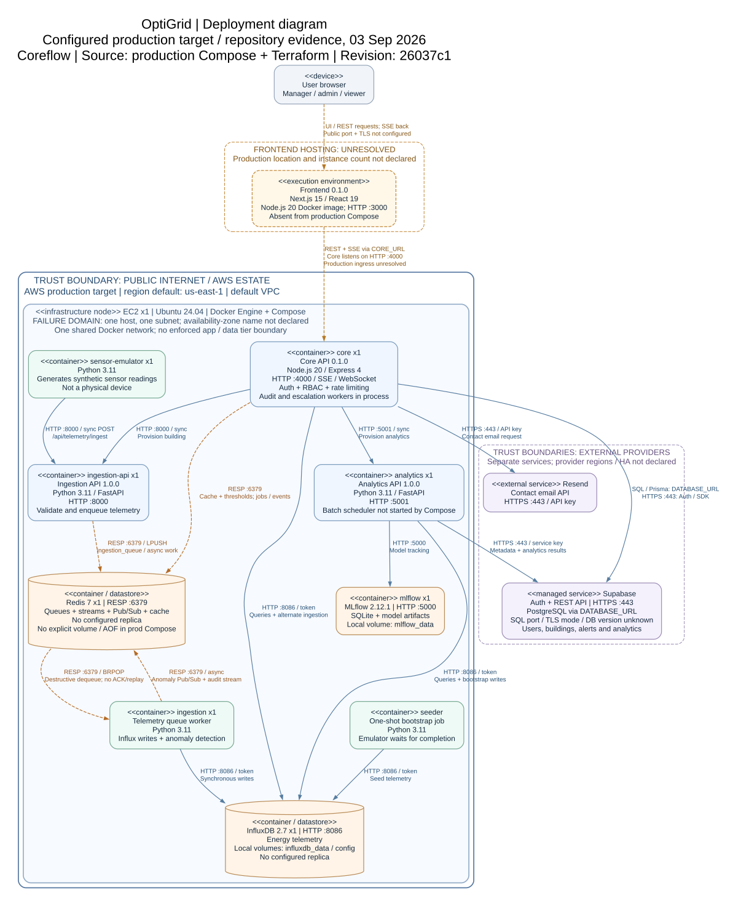

# OptiGrid deployment diagram



**Scope:** configured production target, using the checked-in production Compose file and Terraform. This is a repository review, not confirmation of the running website or cloud account. The root `docker-compose.yml`, local frontend overlay, development EC2 stack, and untracked staging/backup directories are separate configurations.

**System:** OptiGrid | **Environment:** production target | **Project owner:** Coreflow | **Diagram maintenance:** infrastructure role, with service owners reviewing their connections | **Reviewed:** 2026-09-03 | **Source revision:** `26037c1`.

**Read the diagram:** boxes are deployed containers or execution environments; cylinders are data services. The EC2 enclosure is the physical failure domain. Solid arrows show request/dependency paths; dashed arrows explicitly labelled `async` show asynchronous work. Amber dashed frontend links are integration paths whose production deployment is unresolved. Arrows point from the caller to its dependency, except the explicitly labelled Redis dequeue arrow, which follows message delivery. Responses are implicit; SSE flows back to the browser on its established connection. `x1` means one container in the checked-in configuration, not a measured live replica count.

## What the repository establishes

- Terraform defines one EC2 instance in one subnet of the default VPC. Its region defaults to `us-east-1`; the chosen availability zone is not named in the source. Ubuntu 24.04 is selected through an AWS AMI parameter. The Terraform instance-size default is `t3.medium`, but the production deployment script supplies `t3.micro` unless `INSTANCE_TYPE` overrides it. Neither is evidence of the currently running size.
- Production Compose defines nine services: `core`, `ingestion-api`, `ingestion`, `analytics`, `sensor-emulator`, `seeder`, `redis`, `influxdb`, and `mlflow`. The seeder runs once; the other services have one configured container each. There is no load balancer, autoscaling group, second host, standby, or cross-region replication in this configuration.
- Core and the frontend use Node.js 20 images. Python services use Python 3.11. Core/frontend package versions are `0.1.0`; `1.0.0` on the Python API nodes is the FastAPI-advertised API version. Production app image references use `latest`; these labels do not identify an immutable deployed release. Redis 7 and InfluxDB 2.7 images are digest-pinned. MLflow is pinned to 2.12.1 in analytics requirements.
- Core's audit persistence, escalation, anomaly subscription, and BullMQ event handling run inside the core process. They are not separate replicated worker containers.
- InfluxDB and MLflow use local Docker volumes. These volumes share the EC2 failure domain. Production Compose supplies no explicit Redis volume or AOF setting; image defaults are not a documented durability or disaster recovery policy.
- Supabase is referenced by environment variables rather than deployed by this Terraform/Compose stack. Its PostgreSQL version, SQL port, TLS mode, region, replicas, and failover guarantees are not declared. Core uses Prisma/PostgreSQL plus the Supabase SDK; Python components use the Supabase HTTPS REST API. The diagram assumes hosted HTTPS Supabase endpoints, consistent with the repository's example configuration; actual endpoint values remain deployment inputs.

## Connections and trust boundaries

| Connection | Transport and behaviour | Authentication / deployment evidence |
| --- | --- | --- |
| Browser to frontend | UI and same-origin REST requests; SSE response stream | Production host, public port, HTTP version, and TLS termination are not specified. The frontend Docker image listens on HTTP 3000. |
| Frontend to core | REST request/response plus proxied SSE; core HTTP 4000 | Forwards session cookies / bearer tokens. `CORE_URL` must identify a reachable core endpoint. The EC2 production script explicitly excludes the frontend. |
| Browser / frontend to Supabase Auth | HTTPS 443; Google OAuth redirects through the browser, then callback code exchange | Public anon key plus the user's session; configured in the browser client and Google sign-in callback. Google is an external identity dependency, not a service on EC2. These supporting links are omitted from the main figure to keep the deployment enclosure readable. |
| Core to ingestion API | HTTP 8000, synchronous `/init-building` | Internal Docker hostname. No TLS or service authentication is configured on this endpoint. |
| Core to analytics API | HTTP 5001, synchronous `/init-building` | Internal Docker hostname. No TLS or service authentication is configured on this endpoint. |
| Sensor emulator to ingestion API | HTTP 8000, synchronous telemetry POST; processing follows asynchronously | The emulator sends `Authorization: Bearer ...` when `HARDWARE_API_KEY` is set; the FastAPI ingestion route does not validate it. Core's separate ingestion route checks `x-sensor-key`. Do not infer authenticated device ingestion on the configured emulator path. |
| Ingestion API / worker / core to Redis | RESP over TCP 6379; cache, lists, Pub/Sub, streams and BullMQ | No Redis password or TLS is configured by the production Compose file. Queue/stream semantics differ; see below. |
| Core / ingestion worker / analytics / seeder / emulator to InfluxDB | HTTP 8086; telemetry writes, queries, bootstrap data and emulator timestamp lookup | Influx API token. The worker uses synchronous writes; this is not synchronous database replication. |
| Analytics to MLflow | HTTP 5000; model/experiment tracking | No MLflow authentication/TLS is configured in Compose. SQLite and artifacts are stored in `mlflow_data`. |
| Core to Supabase PostgreSQL | SQL over the connection configured by `DATABASE_URL` | Credentials, port, and TLS mode come from that URL. Do not label it PostgreSQL 16, port 5432, or a sync standby without deployment evidence. |
| Core / analytics / seeder / emulator to Supabase APIs | HTTPS 443; Auth or REST data operations | Server-side Supabase keys. Seeder/emulator metadata links are omitted from the main figure. |
| Core to Resend | HTTPS 443; contact-email API request | `RESEND_API_KEY`. No inbound email webhook is defined by this path. |

**Internet / AWS boundary:** the Terraform security group permits TCP 80, 443, 3001 and 4001 publicly, plus SSH 22 from `allowed_ssh_cidr`. Production Compose publishes 4000, 8000, 6379, 8086, 5000 and 5001 to host interfaces by default. Those production ports do not have matching public ingress rules in the checked-in security group. Opening port 443 in a security group does not supply a TLS listener or reverse proxy. The frontend-to-core production route therefore cannot be asserted to work from this configuration alone.

**Application / data tier:** all nine services share the Compose default network. The data stores are distinct processes, but no separate protected data network is defined. The drawing deliberately does not claim an enforced trust boundary here.

**External provider boundary:** Supabase and Resend are outside the EC2 host. Provider deployment regions are unspecified, so the source does not establish data residency or a jurisdiction-based replication design.

## Asynchronous behaviour: what happens after acceptance

1. The configured sensor emulator posts to the FastAPI ingestion service. That API uses `LPUSH ingestion_queue` and returns HTTP 201 after buffering the payload. This acknowledgement does not mean the telemetry is already stored in InfluxDB.
2. The `ingestion` container calls `BRPOP ingestion_queue`, then writes to InfluxDB and evaluates anomalies. Removing a message precedes processing. There is no acknowledgement/reclaim mechanism, automatic failed-payload replay, or telemetry dead-letter queue in this path. A crash after dequeue can lose a reading; this is not an at-least-once processing guarantee.
3. Anomalies are published on `anomalies_channel`; core subscribes and persists anomalies/notifications. Redis Pub/Sub does not retain messages for an offline subscriber.
4. Ingestion failures are published separately to the Redis stream `system:audit-events`. Core's in-process worker consumes using group `core-audit-persistence`, persists audit records, and acknowledges them. It retries pending records; invalid events go to `system:audit-events:dead-letter`, approximately capped at 1,000 entries. No automatic consumer for that dead-letter stream is defined. An operational owner and replay procedure remain to be assigned; this audit stream does not replay lost telemetry.
5. Core defines a BullMQ queue named `analytics-refresh`. Its Python consumer exists in `backend/analytics/src/queue_worker.py`, but no production Compose service starts that module. The analytics service starts through Uvicorn, which also bypasses the `if __name__ == '__main__'` block that starts its hourly scheduler. Neither background path is shown as a running worker in the diagram.

The browser's SSE endpoint exists, but the configured FastAPI/Redis ingestion worker does not forward its telemetry to core's in-memory SSE manager. Core's separate telemetry-ingestion controller does broadcast SSE after accepting a reading. These are different paths; the diagram does not claim that the configured emulator automatically drives the browser stream.

## Applying the lecture conventions

The figure names the infrastructure node, execution environments, versions, configured instance counts, ports, synchronous/asynchronous edges, trust boundaries, external services, failure domain, environment, owner and verification source. Missing deployment facts are stated explicitly. The on-premises halls, Kafka, PostgreSQL 16 replicas, and two-region failover in the lecture are teaching examples; they are not present in this repository's configured topology.

## Keep the diagram true

Edit [deployment.dot](deployment.dot), the canonical text source, when a deployment node or connection changes. Commit the source, rendered images, and this evidence note together. From the repository root, regenerate with Graphviz:

```powershell
dot -Tsvg docs/architecture/deployment.dot -o docs/architecture/deployment.svg
dot -Tpng -Gdpi=120 docs/architecture/deployment.dot -o docs/architecture/deployment.png
```

The SVG is the scalable report/slide asset; the PNG is a convenient preview. Rendering is currently a documented command, not a CI job. Review the diagram alongside changes to these sources:

| Source | Facts it supports |
| --- | --- |
| [Production Compose](../../infrastructure/docker/docker-compose.prod.yml) | Deployed services, startup commands, ports, health checks, environment wiring and volumes |
| [Terraform topology](../../infrastructure/terraform/main.tf) and [defaults](../../infrastructure/terraform/variables.tf) | EC2 host, subnet/VPC, AMI, region, security group and sizing defaults |
| [Production deployment script](../../scripts/deploy-ec2-stack.mjs) | Instance-size override, image transfer and explicit frontend exclusion |
| [Frontend Dockerfile](../../frontend/Dockerfile) and [local overlay](../../infrastructure/docker-compose.local.frontend.yml) | Frontend runtime exists, but its Compose deployment here is local |
| [Core startup](../../backend/core/src/server.ts), [Prisma client](../../backend/core/src/lib/prisma.ts) and [provisioning](../../backend/core/src/services/provisioning.service.ts) | In-process workers, SQL configuration, internal service requests |
| [Ingestion API](../../backend/ingestion/src/main.py), [queue worker](../../backend/ingestion/src/queue_worker.py) and [observers](../../backend/ingestion/src/observers.py) | Telemetry acceptance, destructive dequeue, Influx writes and anomaly Pub/Sub |
| [Audit producer](../../backend/ingestion/src/audit_events.py) and [audit worker](../../backend/core/src/workers/auditEvent.worker.ts) | Audit stream, consumer group, acknowledgement, pending recovery and invalid-event dead letters |
| [Analytics startup](../../backend/analytics/src/main.py), [queue consumer](../../backend/analytics/src/queue_worker.py), [engine](../../backend/analytics/src/core_engine.py) and [requirements](../../backend/analytics/requirements.txt) | Actual startup versus dormant worker paths; Influx, Supabase and MLflow dependencies |
| [Emulator](../../backend/ingestion/src/sensor_emulator.py) and [seeder](../../backend/ingestion/src/seeder.py) | Synthetic telemetry, metadata reads, initial data and last-timestamp lookup |
| [Frontend proxy](../../frontend/lib/coreProxy.ts), [SSE client](../../frontend/lib/useTelemetryStream.ts) and [core telemetry](../../backend/core/src/controllers/telemetry.controller.ts) | Browser/core integration, session forwarding and distinct SSE production path |
| [Google sign-in](../../frontend/components/googleButton.tsx), [OAuth callback](../../frontend/app/api/auth/googleAuth/route.ts) and [contact email](../../backend/core/src/services/contact.services.ts) | External identity and email dependencies |
