# OptiGrid CI/CD Pipeline

## Overview

OptiGrid uses a lightweight production CI/CD pipeline built on GitHub Actions, Docker, GitHub Container Registry (GHCR), Terraform, and Docker Compose. The pipeline validates code, builds and publishes container images, provisions infrastructure, and deploys services to a single Ubuntu server.

## Runtime Container Model

The runtime model uses exactly four containers:

- frontend
- core
- ingestion
- analytics

## External Managed Services

- Supabase for users, metadata, buildings, configs, alerts
- InfluxDB for time-series energy readings and forecasts

## Pipeline Stages

- Checkout code
- Install dependencies
- Lint
- Unit tests
- Build React frontend
- Build Docker images
- Push images to GitHub Container Registry
- Terraform validate, plan, apply
- SSH deployment
- Docker Compose pull/up
- Health checks

## Pipeline Diagram

```mermaid
---
config:
  layout: elk
  elk:
    mergeEdges: false
    nodePlacementStrategy: LINEAR_SEGMENTS
---
flowchart LR
    %% Styling
    classDef source fill:#f9f9f9,stroke:#333,stroke-width:2px,stroke-dasharray:5 5;
    classDef ci fill:#d4e6f1,stroke:#2980b9,stroke-width:2px;
    classDef terraform fill:#d6eaf8,stroke:#2471a3,stroke-width:2px;
    classDef registry fill:#fcf3cf,stroke:#f1c40f,stroke-width:2px;
    classDef deploy fill:#d5f5e3,stroke:#27ae60,stroke-width:2px;
    classDef runtime fill:#e8daef,stroke:#8e44ad,stroke-width:2px;
    classDef external fill:#fadbd8,stroke:#c0392b,stroke-width:2px;

    subgraph Source["Source Control"]
        direction TB
        Dev[Developer]:::source
        GitHub[GitHub Repository<br/>OptiGrid Codebase]:::source
    end

    subgraph CI["Continuous Integration<br/>GitHub Actions"]
        direction TB
        Checkout[Checkout Code]:::ci
        Install[Install Dependencies<br/>pnpm + pip]:::ci
        Lint[Lint Code]:::ci
        Test[Run Unit Tests]:::ci
        BuildFrontend[Build React Frontend]:::ci
        BuildImages[Build Docker Images]:::ci
    end

    subgraph IaC["Infrastructure as Code<br/>Terraform"]
        direction TB
        TFValidate[Terraform Validate]:::terraform
        TFPlan[Terraform Plan]:::terraform
        TFApply[Terraform Apply]:::terraform
        Server[Provision / Update<br/>4GB Ubuntu Server]:::terraform
        Network[Configure Firewall<br/>Ports 22, 80, 443]:::terraform
    end

    subgraph Registry["Container Registry"]
        direction TB
        GHCR[GitHub Container Registry<br/>Versioned Docker Images]:::registry
    end

    subgraph CD["Continuous Deployment"]
        direction TB
        SSH[SSH into Server]:::deploy
        Pull[Docker Compose Pull]:::deploy
        Up[Docker Compose Up]:::deploy
        Health[Health Checks]:::deploy
    end

    subgraph Runtime["4GB Server Runtime"]
        direction TB
        Frontend[Container 1<br/>frontend<br/>React Web App]:::runtime
        Core[Container 2<br/>core<br/>API Gateway + Config Service]:::runtime
        Ingestion[Container 3<br/>ingestion<br/>Telemetry Worker]:::runtime
        Analytics[Container 4<br/>analytics<br/>Forecasting + Anomaly Detection]:::runtime
    end

    subgraph ExternalData["External Managed Data Services"]
        direction TB
        Supabase[(Supabase<br/>Users, metadata, buildings, configs, alerts)]:::external
        Influx[(InfluxDB<br/>Time-series readings and forecasts)]:::external
    end

    Dev -->|Push code| GitHub
    GitHub -->|Trigger workflows| Checkout

    Checkout --> Install
    Install --> Lint
    Lint --> Test
    Test --> BuildFrontend
    BuildFrontend --> BuildImages
    BuildImages -->|Push versioned images| GHCR

    Checkout --> TFValidate
    TFValidate --> TFPlan
    TFPlan --> TFApply
    TFApply --> Server
    TFApply --> Network

    GHCR --> SSH
    Server --> SSH
    SSH --> Pull
    Pull --> Up
    Up --> Health

    Health --> Frontend
    Health --> Core
    Health --> Ingestion
    Health --> Analytics

    Frontend --> Core
    Core --> Supabase
    Core --> Influx
    Ingestion --> Core
    Ingestion --> Influx
    Analytics --> Supabase
    Analytics --> Influx
```

## Required GitHub Secrets

| Secret | Purpose |
| --- | --- |
| AWS_ACCESS_KEY_ID | AWS access key for Terraform workflow authentication |
| AWS_SECRET_ACCESS_KEY | AWS secret key for Terraform workflow authentication |
| AWS_REGION | AWS region used by Terraform and deployment workflows |
| TF_VAR_ssh_public_key | Public SSH key content used by Terraform EC2 key pair |
| TF_VAR_allowed_ssh_cidr | CIDR allowed to access the server via SSH |
| SERVER_HOST | Ubuntu server hostname or public IP for deployment |
| SERVER_USER | SSH username on deployment server |
| SERVER_SSH_PRIVATE_KEY | Private key used by GitHub Actions SSH/SCP deployment steps |
| GHCR_USERNAME | Username for GHCR login on the target server |
| GHCR_TOKEN | Token for GHCR pull access on the target server |
| SUPABASE_URL | Supabase project URL used by application services |
| SUPABASE_SERVICE_ROLE_KEY | Supabase service role key used by backend services |
| INFLUXDB_URL | InfluxDB endpoint URL |
| INFLUXDB_TOKEN | InfluxDB token used by ingestion and analytics |
| INFLUXDB_ORG | InfluxDB organization name |
| INFLUXDB_BUCKET | InfluxDB bucket name |

## Deployment Model

Terraform provisions and updates the Ubuntu server and networking baseline. Docker Compose then runs the four application containers on that server using images pulled from GHCR.

## 4GB Server Constraint

This deployment is intentionally limited to four containers to fit a 4GB server envelope while still supporting end-to-end production functionality. It is a lightweight production deployment model optimized for constrained infrastructure.
